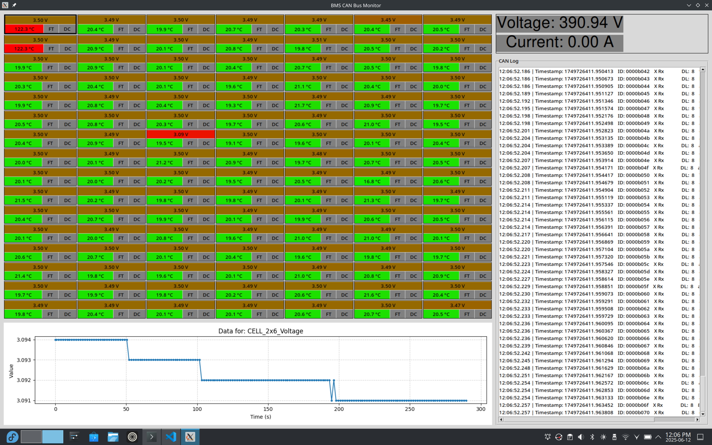

# BMS GUI Telemetry Display 

A Python application that provides a real-time graphical user interface (GUI) to display and plot telemetry data from our Battery Management System (BMS) via a CAN bus.



## Features

* **Live Data Grid:** Displays incoming BMS data in a clean, organized table.
* **Automatic Logging:** Automatically creates a CAN message log everytime the script is run.
* **CAN Log:** Displays other CAN IDs in a list.
* **Interactive Plotting:** Simply click on any data cell to generate a plot showing its value over time.
* **Database Utility:** Includes a helper script to easily create the required CAN database (`.dbc`) file.


## Requirements

### Software

* Python 3.x
* The following Python libraries:
    * `tkinter` (Real-time GUI)
    * `matplotlib` (Live Data plotting)
    * `python-can` (CAN interface and data parsing)
    * `cantools` (CAN Database creation and parsing)

### Hardware

* A CAN to USB adapter supported by `python-can`. This project was tested with an `slcan` adapter, but others may work.


## Usage

1.  **(Optional) Create CAN Database:**
    * The default dbc file used by the team is generated with `db-maker.py` and it is provided in the `databases` folder.
    * Modify the script if to generate your own
    * Or for custom dbc file input, modify the dbc file path in the main file

2.  **Configure the Application:**
    * Open the main script and update the CAN bus interface (e.g., `'slcan'`, `'can0'`) and the path to your `.dbc` file.

3.  **Run the GUI:**
    * Make sure your CAN adapter is connected.
    * Execute the main script to launch the telemetry display.
    ```bash
    python main6.py
    ```

